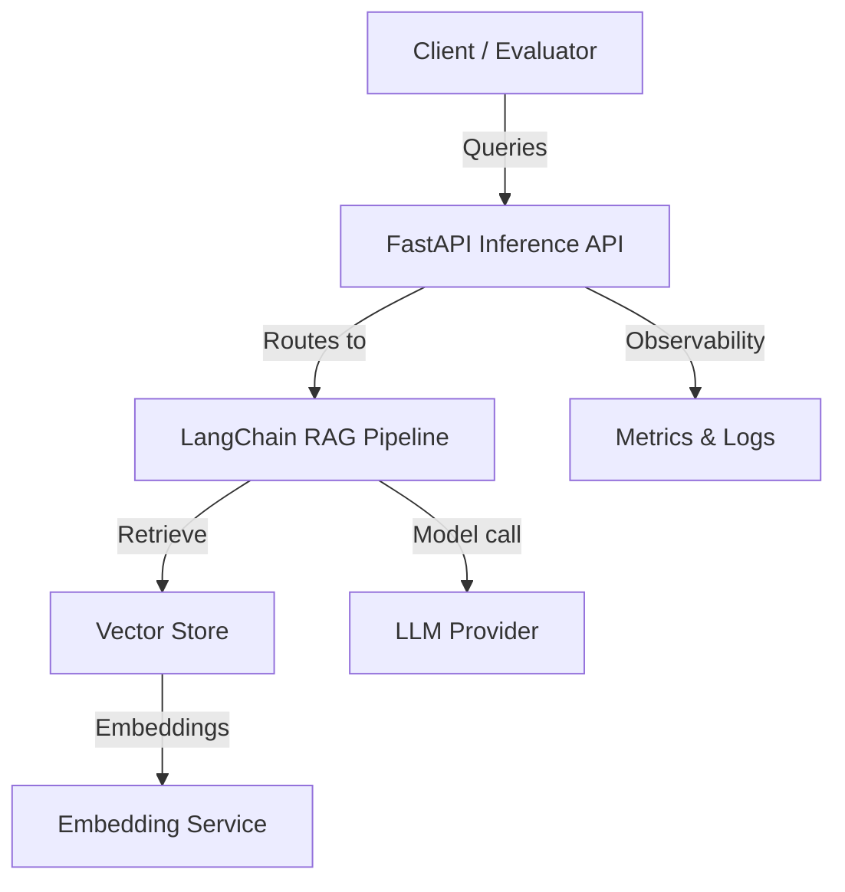

# AI LangChain RAG

## Project overview / Descripción general
This project demonstrates a Retrieval-Augmented Generation (RAG) pipeline using LangChain. It focuses on secure document ingestion, vector storage, and prompt orchestration to deliver grounded responses while keeping credentials and data flows isolated.

## Architecture / Arquitectura


- **FastAPI Inference API:** Entry point exposing secure endpoints with input validation and rate limiting suggestions.
- **LangChain RAG Pipeline:** Chains retrieval + generation with clear separation of concerns for loaders, retrievers, and evaluators.
- **Vector Store:** Stores embeddings for efficient semantic search; configured via environment variables.
- **LLM Provider & Embedding Service:** External services referenced via secure secrets, never hardcoded.
- **Metrics & Logs:** Hooks for tracing, metrics, and audits.

## Tech stack / Stack técnico
- Language: Python
- Frameworks: LangChain, FastAPI
- Data: Vector store (e.g., Chroma, PostgreSQL + pgvector)
- Infra: Docker, Docker Compose
- Tooling (suggested): pytest, ruff, black for quality gates

## Installation & Run / Instalación y ejecución
1. Clone the repository and move into the project folder:
   ```bash
   git clone https://github.com/MishellRamosAcaro/Inicio.git
   cd ai_langchain_rag
   ```
2. Create a virtual environment and install dependencies (to be defined in `requirements.txt`):
   ```bash
   python -m venv .venv
   source .venv/bin/activate
   pip install -r requirements.txt
   ```
3. Configure environment variables in `.env` (keys for vector store, LLM provider, and telemetry endpoints).
4. Run the API locally:
   ```bash
   uvicorn app.main:app --reload
   ```
5. Optional: start via Docker Compose once `docker-compose.yml` is added:
   ```bash
   docker compose up --build
   ```

## Folder structure / Estructura de carpetas
- `app/` — FastAPI entrypoints, routers, and dependency injection modules.
- `rag/` — LangChain components (loaders, retrievers, prompt templates, evaluators).
- `tests/` — Pytest suite covering ingestion, retrieval, and API contracts.
- `configs/` — Settings and environment templates.
- `scripts/` — Utilities for indexing and evaluation.

## Roadmap / Mejoras futuras
- Add reference implementation of RAG chain with configurable retrievers.
- Provide evaluation notebooks for hallucination checks and latency baselines.
- Integrate CI pipeline (ruff, black, pytest) and pre-commit hooks.
- Offer secure defaults for rate limiting, CORS, and secret management.

## Security / Seguridad
- Keep secrets in `.env` and never commit them; recommend using secrets managers for production.
- Validate and sanitize all user inputs at the API boundary.
- Use least-privilege credentials for databases/vector stores.
- Enable HTTPS, CORS restrictions, and request size limits.
- Log minimal necessary data to avoid leaking sensitive content.
