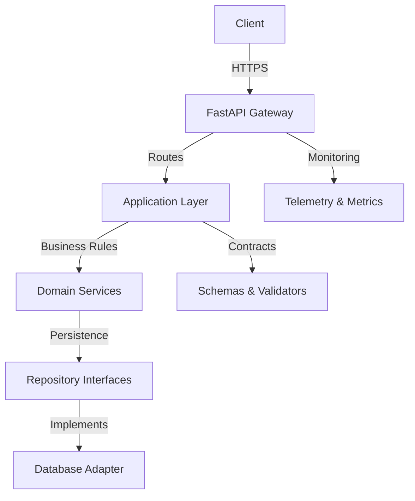

# Backend FastAPI Template

## Project overview / Descripción general
Template for building secure, maintainable FastAPI backends with clean architecture, dependency injection, and strong validation. It is designed to be a starting point for services that need clarity in layers and observability from day one.

## Architecture / Arquitectura


- **FastAPI Gateway:** HTTP interface with rate limiting and CORS configuration suggestions.
- **Application Layer:** Use cases orchestrating domain logic and I/O boundaries.
- **Domain Services:** Core business rules following SOLID and clean architecture.
- **Schemas & Validators:** Pydantic models to enforce input/output contracts.
- **Repository Interfaces & Adapters:** Port/adapter separation for persistence (PostgreSQL recommended).
- **Telemetry & Metrics:** Hooks for logging, tracing, and health checks.

## Tech stack / Stack técnico
- Language: Python
- Framework: FastAPI
- Data: PostgreSQL (primary), MariaDB (alternative)
- Infra: Docker, Docker Compose
- Tooling (suggested): pytest, ruff, black, mypy

## Installation & Run / Instalación y ejecución
1. Install dependencies:
   ```bash
   python -m venv .venv
   source .venv/bin/activate
   pip install -r requirements.txt
   ```
2. Configure environment variables in `.env` (database URL, JWT secrets, CORS origins).
3. Run development server:
   ```bash
   uvicorn app.main:app --reload
   ```
4. Run with Docker Compose (once a compose file is added):
   ```bash
   docker compose up --build
   ```

## Folder structure / Estructura de carpetas
- `app/api/` — Routers and controllers with dependency injection.
- `app/core/` — Settings, security utilities, logging.
- `app/domain/` — Entities and domain services.
- `app/infrastructure/` — Adapters for persistence and external services.
- `tests/` — Pytest suites for units, integration, and contract tests.

## Roadmap / Mejoras futuras
- Add JWT authentication and authorization scaffolding.
- Include SQLAlchemy + Alembic migrations with repository pattern.
- Provide OpenAPI docs enhancements and example clients.
- Configure CI for linting (ruff, mypy) and testing.

## Security / Seguridad
- Enforce input validation with Pydantic and strict types.
- Keep secrets in environment variables; recommend secret managers for production.
- Apply CORS restrictions and rate limiting for public endpoints.
- Use prepared statements/ORM to prevent SQL injection.
- Add HTTPS termination and security headers at the gateway.
