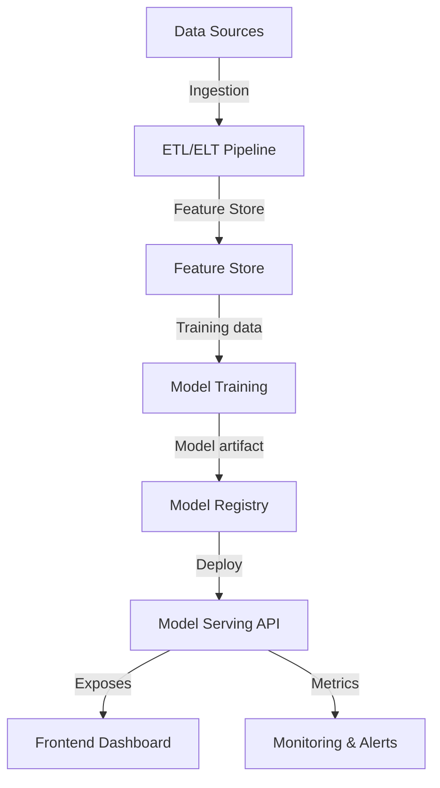

# Full-Stack MLOps

## Project overview / Descripción general
An end-to-end MLOps blueprint aligning data pipelines, model serving, and a frontend for insights. It emphasizes reproducibility, observability, and secure handling of datasets and model artifacts.

## Architecture / Arquitectura


- **ETL/ELT Pipeline:** Ingest and transform data with lineage tracking.
- **Feature Store:** Centralized, versioned features for training/serving parity.
- **Model Training:** Reproducible runs with parameterization and evaluation.
- **Model Registry:** Versioned artifacts with promotion rules.
- **Model Serving API:** FastAPI service for predictions and health checks.
- **Frontend Dashboard:** Vue-based UI to visualize metrics, predictions, and model status.
- **Monitoring & Alerts:** Telemetry for latency, drift, and data quality.

## Tech stack / Stack técnico
- Languages: Python, TypeScript
- Backend: FastAPI
- Frontend: Vue
- Data: PostgreSQL/MariaDB; object storage for artifacts
- Infra: Docker Compose orchestrating API, frontend, and supporting services
- Tooling (suggested): pytest, ruff, black, mypy, vitest, eslint, prettier

## Installation & Run / Instalación y ejecución
1. Bring up the stack with Docker Compose (once service definitions are added):
   ```bash
   docker compose up --build
   ```
2. Alternatively, run services locally:
   - Backend: `uvicorn app.main:app --reload`
   - Frontend: `npm install && npm run dev`
3. Configure `.env` files for API keys, database credentials, and storage buckets.

## Folder structure / Estructura de carpetas
- `backend/` — FastAPI app, domain logic, and adapters.
- `frontend/` — Vue dashboard consuming the serving API.
- `pipelines/` — Data ingestion, feature engineering, and training pipelines.
- `infrastructure/` — IaC or deployment manifests.
- `tests/` — Combined unit/integration tests for backend, pipelines, and frontend.

## Roadmap / Mejoras futuras
- Add CI/CD with quality gates and preview deployments.
- Introduce feature store integration and drift detection.
- Provide sample notebook for offline evaluation and experimentation tracking.
- Secure artifact storage with signed URLs and role-based access.

## Security / Seguridad
- Enforce principle of least privilege across databases, storage, and registry.
- Keep credentials in environment variables or secret managers; never commit them.
- Validate inputs at API boundaries and sanitize outputs before logging.
- Enable HTTPS termination, audit logging, and dependency scanning in CI.
